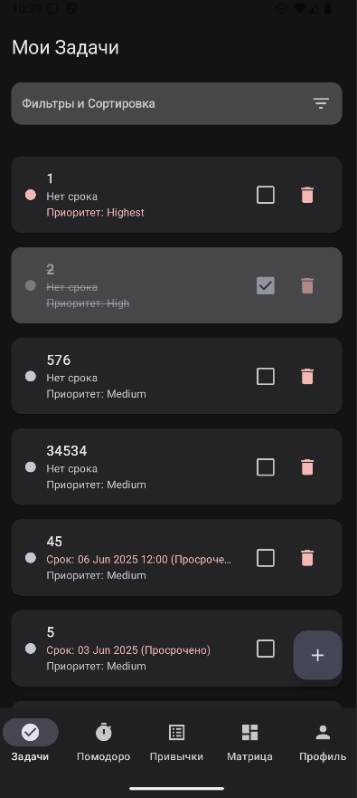
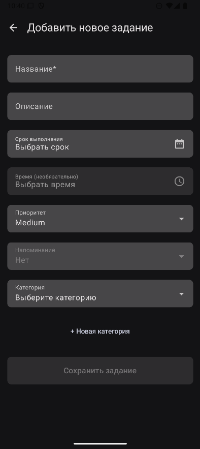
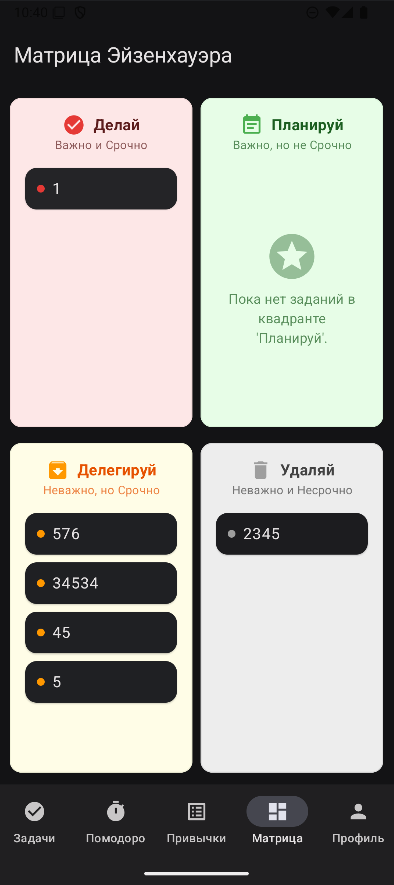
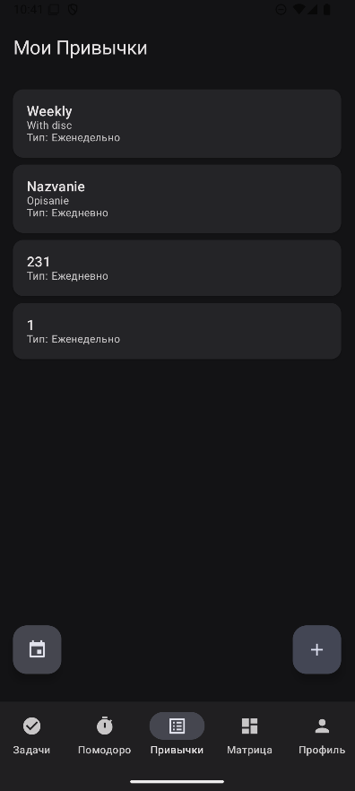
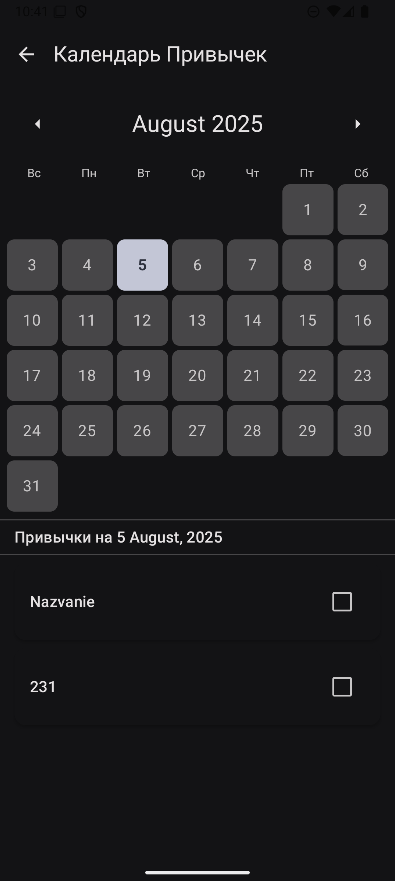
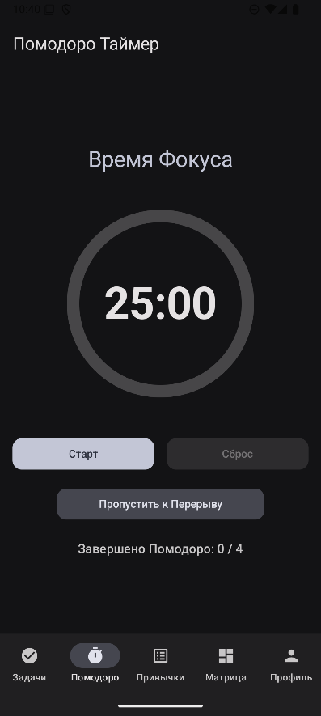
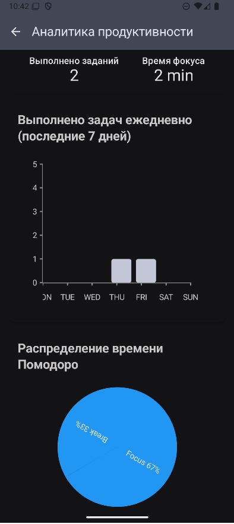
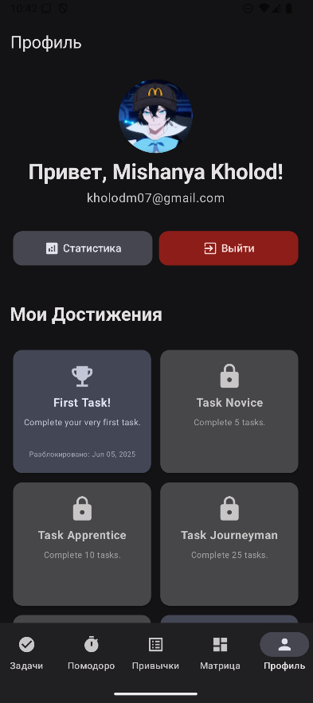

# Productivity Organizer

A comprehensive Android productivity application built with modern Android development practices. This is my second Kotlin project, showcasing clean architecture, Jetpack Compose, and various productivity features.

## 📱 Features

### 🗂️ Task Management
- Create, edit, and organize tasks with categories
- Eisenhower Matrix for task prioritization (Urgent/Important classification)
- Task filtering and sorting options
- Visual task completion tracking

### 🎯 Habit Tracking
- Build and maintain daily habits
- Interactive calendar view for habit completion
- Habit statistics and streaks
- Custom habit creation with flexible scheduling

### ⏱️ Pomodoro Timer
- Focus sessions with customizable work/break intervals
- Session tracking and statistics
- Background notifications for session management
- Integration with overall productivity analytics

### 🏆 Achievement System
- Gamified productivity experience
- Unlock achievements for consistent task completion and habit building
- Visual achievement gallery
- Progress tracking towards goals

### 📊 Analytics Dashboard
- Comprehensive productivity insights
- Task completion trends and statistics
- Pomodoro session analytics
- Visual charts and progress indicators

### 🔐 Authentication
- Google Sign-In integration
- Secure user authentication
- Profile management

## 🛠️ Technology Stack

### Core Technologies
- **Language**: Kotlin
- **UI Framework**: Jetpack Compose with Material 3
- **Architecture**: MVVM with Clean Architecture
- **Dependency Injection**: Hilt (Dagger)

### Data & Storage
- **Local Database**: Room with SQLite
- **Remote Backend**: Supabase
- **Background Tasks**: WorkManager
- **Data Synchronization**: Local ↔ Remote sync

### Libraries & Tools
- **Navigation**: Jetpack Navigation Compose
- **Async Programming**: Kotlin Coroutines & Flow
- **Image Loading**: Coil
- **Date/Time**: Java Time API
- **Charts**: Custom Compose charts
- **Authentication**: Google Sign-In

## 🏗️ Architecture

The app follows Clean Architecture principles with three main layers:

### Data Layer
- **Local**: Room DAOs for SQLite operations
- **Remote**: Supabase client for cloud synchronization
- **Repository**: Unified data access with offline-first approach

### Domain Layer
- **Use Cases**: Business logic encapsulation
- **Managers**: Achievement and productivity logic
- **Models**: Data entities and domain objects

### UI Layer
- **ViewModels**: State management with LiveData/StateFlow
- **Screens**: Jetpack Compose UI components
- **Navigation**: Single-activity architecture with Compose Navigation

## 📁 Project Structure

```
app/src/main/java/com/example/productivityorganizer/
├── data/
│   ├── local/          # Room database entities & DAOs
│   ├── remote/         # Supabase integration
│   └── repository/     # Data repositories
├── di/                 # Dependency injection modules
├── domain/
│   └── manager/        # Business logic managers
├── ui/
│   ├── navigation/     # Navigation setup
│   ├── screens/        # UI screens
│   ├── theme/          # App theming
│   └── viewmodels/     # ViewModels
└── utils/              # Utility classes
```

## 🚀 Getting Started

### Prerequisites
- Android Studio Arctic Fox or later
- Minimum SDK: API 24 (Android 7.0)
- Target SDK: API 34 (Android 14)

### Setup
1. Clone the repository
2. Open project in Android Studio
3. Configure Supabase credentials in `local.properties`:
   ```
   SUPABASE_URL=your_supabase_url
   SUPABASE_ANON_KEY=your_supabase_anon_key
   ```
4. Configure Google Sign-In:
   - Add your `google-services.json` to `app/` directory
   - Update OAuth client ID in authentication setup
5. Build and run the application

## 🔧 Configuration

### Supabase Setup
1. Create a new Supabase project
2. Set up the following tables:
   - `tasks`: User tasks with categories and priorities
   - `habits`: Habit definitions and completions
   - `achievements`: User achievements
   - `pomodoro_sessions`: Timer session data

### Google Sign-In
1. Create OAuth 2.0 credentials in Google Cloud Console
2. Add your app's SHA-1 fingerprint
3. Download and add `google-services.json`

## 📊 Screenshots

### Main Features




### Habit Tracking



### Productivity Tools



### Additional Features



## 🎯 Key Learnings

This project represents significant growth in Android development skills:

### Technical Achievements
- **Jetpack Compose**: Complete migration from XML to declarative UI
- **Clean Architecture**: Proper separation of concerns and testability
- **Advanced State Management**: Complex state flows with Compose
- **Background Processing**: WorkManager for notifications and sync
- **Cloud Integration**: Real-time data synchronization with Supabase

### Development Practices
- **Dependency Injection**: Hilt implementation for scalable architecture
- **Repository Pattern**: Consistent data access across local and remote sources
- **Error Handling**: Comprehensive error states and user feedback
- **Material Design**: Modern UI/UX following Material 3 guidelines

### Problem Solving
- **Offline-First**: Robust offline functionality with sync capabilities
- **Performance Optimization**: Efficient list rendering and data loading
- **User Experience**: Intuitive navigation and feedback systems

## 🔮 Future Enhancements

- [ ] Push notifications for task reminders
- [ ] Widget support for quick task access
- [ ] Advanced analytics with ML insights
- [ ] Social features for habit sharing
- [ ] Integration with calendar apps
- [ ] Dark mode optimization
- [ ] Multi-language support

## 📄 License

This project is developed for educational and portfolio purposes.

## 👨‍💻 Author

Built as part of Android development learning journey - Second Kotlin project showcasing modern Android architecture and comprehensive feature implementation.

---

*Star this repository if you find it helpful for learning Android development with Kotlin and Jetpack Compose!*